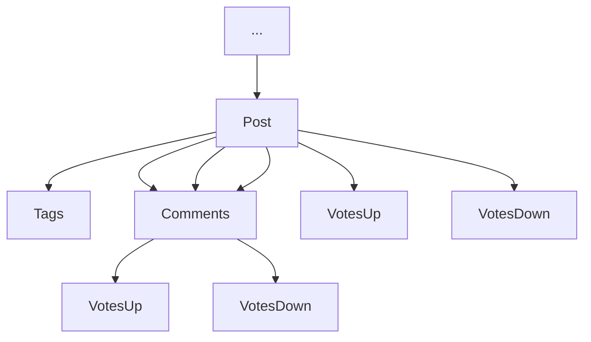
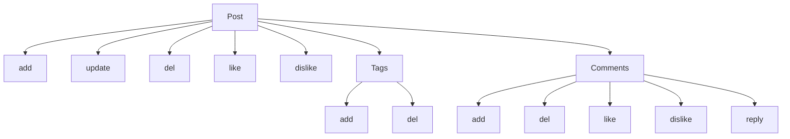

# Post Module
## Simple management of Posts

### Module Dependencies

1. [App](https://github.com/DviDev/app-module)
2. [Workspace](https://github.com/DviDev/workspace-module)

### Post

### Post Actions

### Actions
1. Post
   1. Create
      1. Conditions
         1. [ ] User must be logged
      2. Field validations
         1. user_id
            1. [ ] required
            2. [ ] valid
         2. title
            1. [ ] required
            2. [ ] min length: 2 words
            3. [ ] max length: 255
         3. content
            1. [ ] required
         4. thumbnail_image_path
            1. [ ] max lenght: 255
         5. poll_id
            1. [ ] valid
   2. Update
      1. Conditions
         1. [ ] User must be logged
         2. [ ] User must be owner
         2. [ ] Register must exist
      2. Field validations
         1. id
            1. [ ] required
            2. [ ] valid
         2. title
             1. [ ] required
             2. [ ] min length: 2 words
             3. [ ] max length: 255
         3. content
             1. [ ] required
         4. thumbnail_image_path
             1. [ ] max lenght: 255
   3. Delete
      1. Conditions
         1. [ ] User must be logged
         2. [ ] User must be owner
         2. [ ] Register must exist
      2. Field validation
         1. id
            1. [ ] required
            2. [ ] valid
2. Post Comment
   1. Create
      1. Conditions
         1. [ ] User must be logged
         2. [ ] User must be workspace participant
      2. Field validations
         1. post_id
            1. [ ] required
            2. [ ] valid
         2. parent_id
            1. [ ] valid
         3. content
            1. [ ] required
   2. Delete
      1. Conditions
         1. [ ] User Should be logged
         2. [ ] User must be owner
         3. [ ] Comment must exist
      2. Field validation
         1. id
            1. [ ] required
            2. [ ] valid
   3. Like
      1. Conditions
         1. [ ] User must be logged
         2. [ ] User must be workspace participant
         3. [ ] Comment must exist
      2. Field validations
         1. id
            1. [ ] required
   4. Dislike
      1. Conditions
         1. [ ] User must be logged
         2. [ ] User must be workspace participant
         3. [ ] Comment must exist
      2. Field validations
          1. id
              1. [ ] required
   5. Reply
      1. Conditions
         1. [ ] User must be logged
         2. [ ] User must be workspace participant
         3. [ ] Comment must exist
      2. Field validations
         1. id
            1. [ ] required
         2. content
            1. [ ] required 
3. Post Tag
   1. Create
      1. Conditions
         1. [ ] User must be logged
         3. [ ] Post must exist
      2. Field validations
         1. post_id
            1. [ ] required
         2. tag
            1. [ ] required
            2. [ ] min lenght: 3
            3. [ ] max lenght: 50
   2. Delete
      1. Conditions
         1. [ ] User must be logged
         2. [ ] User must be post owner
         3. [ ] Tag must exist
      2. Field validations
         1. id
            1. [ ] required
